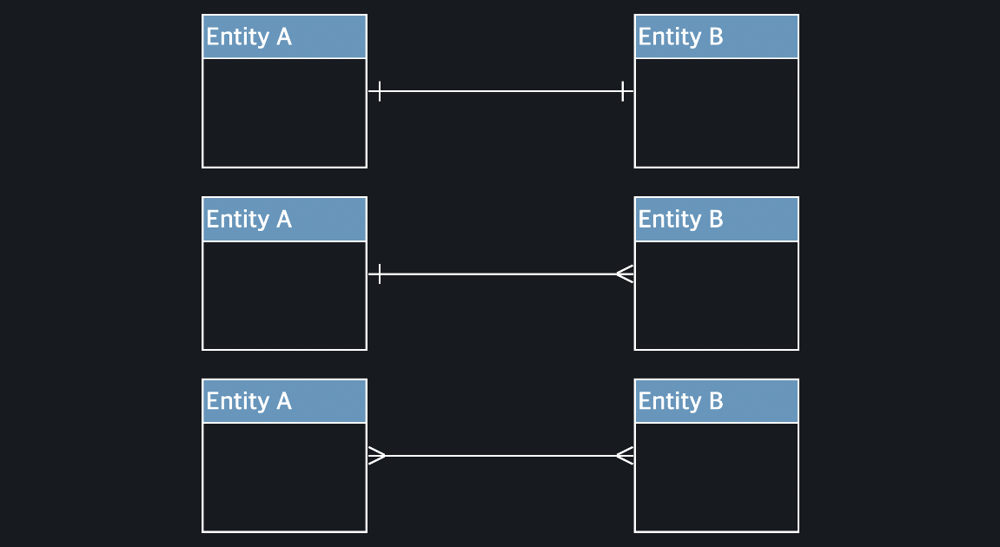

#  논리적 모델링
### 테이블과 컬럼, 구조를 정하는것 

### 비즈니스 룰
```
데이터 모델링은 Entity , attribute, relationship 파악으로 부터 시작한다. 
  -> 비즈니스 룰 (사업 규칙)으로 정리한다. 특정 조직이 운영되기 위해 따라야하는 정책, 절차,원칙
   
   비즈니스 룰예시 
    1) 유저는 상품을 주문할수 있다. 
    2) 동일한 주문 내역은 한번의 배달로, 3일안에 유저가 지정한 배송지에 전달되어야한다. 
        만약 그렇지 못할 시 , 유저에게 최대한 빨리 알려줘야한다.
    3) 유저는 상품에 한 평가를 줄 수 있다. 평가는 두 종류의 데이터 , : 1-5 사이 자연수의 별점, 그리고 200자이내 
        줄글을 통해 알수 있다. 
```
###  Entity , attribute, relationship후보 찾기 
   ```
   1) 모든 명사는 entity 후보이다. 
   2)  모든 동사는 relation 후보이다. 
   3) 하나의 값으로 표현할 수있는 명사는 attribute 후보이다. 
   ```
- 개발자는 알아서 식별 ID 나 연결관계를 나타내는 Foreign Key등이 있어야한다. 
- Attribute과 relationship들의 특성에따라 모델링이 바뀔 수 있다.

#### Attribute 후보 찾기 예외 경우
바로 세 번째 원칙인 "하나의 값으로 표현할 수 있는 명사는 attribute 후보입니다"의 예외 경우. 하나의 값으로 표현할 수 있더라도, 하나의 entity가 여러 개의 값을 가져야 하는 경우


#### 카디널리티 Cardinality
Entity type A와 B사이에서 A Entity 한 개가 B Entity 몇 개와 연결될수 있고 , Bentity 한 개가 Aentity 몇 개와 
연결될 수 있는지 일대일, 일대다,다대다 (어떤 관계가 있는지에 따라 모델링이 바뀐다.)

- [1:1 일대일 관계모델링](#)
- [1:N 일대다 관계모델링](#)
- [M:N 다대다 관계모델링](#)


### 1:1 일대일 관계모델링

첫 번째 관계는 1:1 (일대일) 관계입니다. 일대일 관계는 A entity 하나가 B entity 하나에만 연결될 수 있고, 마찬가지로 B entity 하나도 A entity 하나에만 연결될 수 있는 관계를 의미
1:1 관계로는 법적 부부 관계, 시민과 주민등록증 관계가 있다.

1. 외래키의 값은 NULL이거나 참조 릴레이션의 기본키 값과 동일해야 한다.
2. 외래키 값은 참조할 수 없는 값을 가질 수 없다.


### 1:N 관계
 일대다 관계는 A entity 하나가 B entity 여러 개에 연결될 수 있고, 반대로 B entity는 A entity 하나에만 연결될 수 있는 관계
 1:N 관계로는 쇼핑몰 사이트에서 유저와 평가의 관계, 선생님과 수업의 관계가 있다.


### M:N 관계
세 번째 관계는 M:N (다대다) 관계입니다. 다대다 관계는 A entity 하나가 B entity 여러 개에 연결될 수 있고, 마찬가지로 B entity 하나도 A entity 여러 개에 연결될 수 있는 관계
M:N 관계로 대표적으로는 유저와 상품 사이 찜하기 관계, 학생과 수업의 수강 관계가 있다.

### 최소 카디널리티
1:1, 1:N, M:N 관계는 각각 한 entity가 다른 entity에 대해서 최대 몇 개가 연결될 수 있는지를 표현
하지만, 특정 관계에서 각 entity가 하나도 없어도 되는지, 아니면 최소한 하나가 있어야 하는지를 나타내는 최소 카디널리티도 중요한 내용이다.

#### 카디널리티 정하기
, entity를 '어떻게' 사용하고 싶은지에 따라 결정
