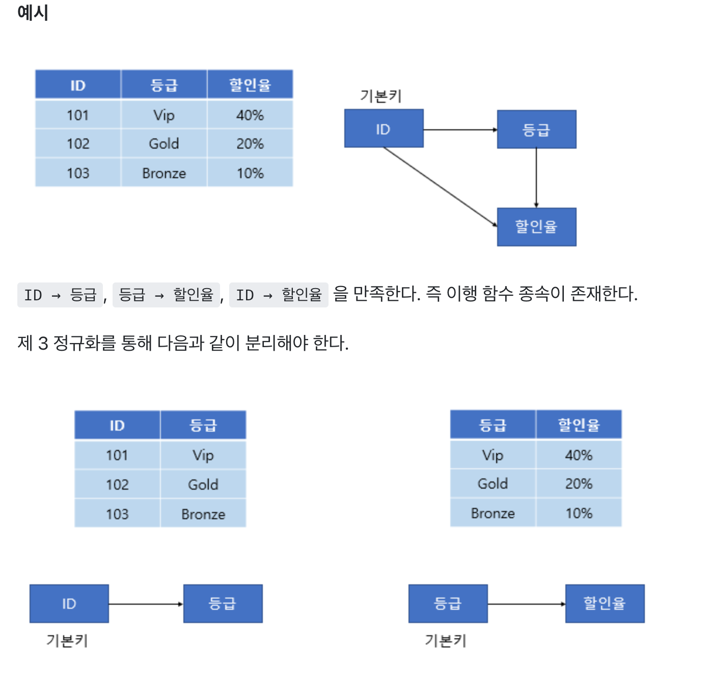

# 정규형

#### 3NF까지 정규화를 하고 나면, 중복되는 데이터 등 모델링 실수로 생기는 데이터베이스 이상 현상을 웬만해서는 다 예방할 수 있습니다.

### 1NF
나눌 수 없는 단일 값

테이블이 1NF에 부합하기 위해서는 테이블 안에 있는 모든 값이 나눌 수 없는 단일 값이어야 합니다.

-- 
1NF를 지키기 위해서 단순히 테이블의 컬럼을 늘리게 된다면 구조적으로 NULL이 많이 생기게 되는 문제가 발생
>>> NULL은 아무 값도 없는, 즉 0개의 값을 저장하는 건데요. 0개는 단일 값, 즉 하나의 값에 해당하지 않기 때문에 컬럼을 늘리는 것과 같이 구조적으로 NULL이 많이 발생할 수 있는 테이블들이 1NF에 부합한다고 볼 수 없다

### 2NF
1NF에 부합(단일값)
기본키가 아닌 모든 속성이 기본키에 완전 함수 종속되면 제2정규형

** 함수 종속성이란?
어떤 릴레이션 R이 있고, 제목의 부분집합 두 개를 A, B. 릴레이션 R의 모든 튜플이 A의 값이 같다면 B의 값도 같은 경우가 있을 수 있다. 이 경우에 한해서 B는 A에 함수 종속한다고 하고, 이러한 관계성을 A → B라고 기술한다.
→ A의 값을 알면 B의 값을 알 수 있다는 의미다. B는 중복이 허용된다.
 브랜드 국가는 브랜드에 대해서, 가격, 디자이너, 디자이너 국적은 제품 이름과 브랜드에 대해서, 재고는 제품 이름, 브랜드, 크기에 대해서 함수 종속성이 있죠.

**Candidate Key : 하나의로우를특정지을 수 있는 attribute들의 최소 집합이라하는데 

#### 2NF 는 Candidate Key의 일부분에 대해서만 함수 종속성이 있는 non-prime attribute 가 없어야한다.
예) 테이블 분리하기
2NF에 부합하게 만들기 위해서는 product 테이블을, 모든 non-prime attribute이 candidate key의 전체에만 함수 종속성이 있는 세 개의 테이블로 분리해야 합니다.

### 3NF
이행 함수 종속을 제거

**이행 함수 종속 (Transitive Functional Dependency)
A → B, B → C 일 때 A → C 를 만족하면 이행 함수 종속이라고 한다.
